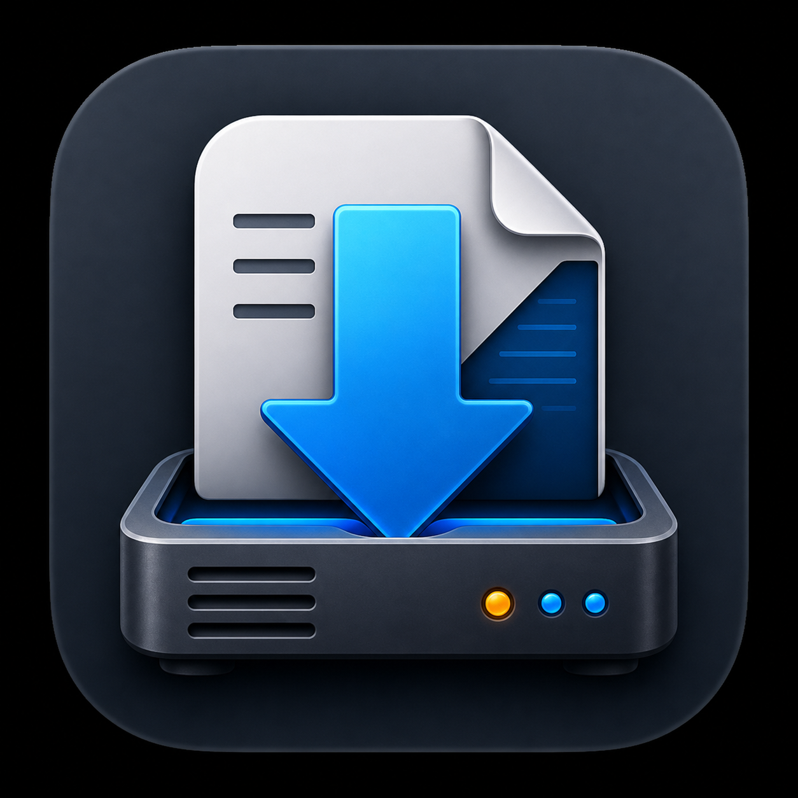

# SabMate

SabMate is a native macOS SwiftUI menu bar app for viewing and controlling a SABnzbd server.

It is built to feel at home on macOS: a compact menu bar entry for everyday queue control, plus a full window for queue, history, server status, settings, and adding NZBs.



## Features

- Menu bar app with no Dock icon
- Live auto-refreshing queue, history, and server pages
- Queue status, speed, progress, pause, resume, and delete
- Recent history
- Server download totals
- Add an NZB by URL
- Upload a local `.nzb` file
- Cleans some malformed NZB files by trimming junk after the closing `</nzb>` tag before upload
- Native macOS settings for SABnzbd host, port, HTTPS, and API key

## Open in Xcode

Open:

```text
SabMate.xcodeproj
```

Choose the `SabMate` scheme, select `My Mac`, then press Run.

The app appears in the macOS menu bar. Use the menu bar item to open the main SabMate window.

## Connect to SABnzbd

In the app, open Settings and enter:

- Host: your SABnzbd server address, for example `192.168.1.10`
- Port: usually `8080` for HTTP or `9090` for HTTPS
- HTTPS: enable only if your SABnzbd server uses HTTPS
- API key: found in SABnzbd under Config > General > API Key

SabMate checks the saved connection on launch. If the server is reachable, it opens normally. If the connection is missing or unavailable, it prompts for Settings.

## Build From Terminal

If you want a quick compile check without opening Xcode:

```sh
xcodebuild -project SabMate.xcodeproj -scheme SabMate -configuration Debug -derivedDataPath .DerivedData build
```

## Privacy

SabMate stores the SABnzbd connection settings locally in macOS user defaults. The API key is not committed to this repository.
